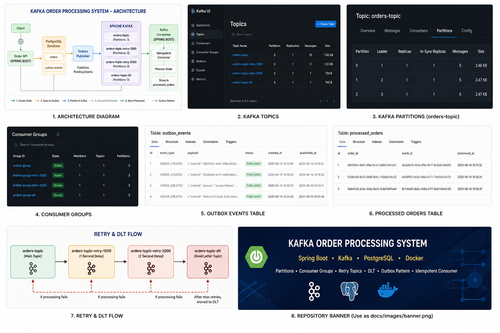

# 🚀 Kafka Order Processing System



A Spring Boot project demonstrating real-world Kafka messaging patterns including Consumer Groups, Partitions, Rebalancing, Manual Acknowledgment, Retry Topics, Dead Letter Topics (DLT), Idempotent Consumers, Outbox Pattern, Avro Serialization, and Schema Registry integration.

---

## 🎯 Project Goal

Most Kafka tutorials stop at:

```text
Producer → Topic → Consumer
```

This project goes beyond the basics and demonstrates how real-world systems handle:

* Message retries
* Poison messages
* Duplicate events
* Consumer failures
* Event publishing consistency
* Message ordering
* Offset management

---

# 🏗 Architecture

```text
┌─────────────┐
│   Client    │
└──────┬──────┘
       │
       ▼
┌─────────────┐
│ Order API   │
└──────┬──────┘
       │
       ├──────────────────┐
       ▼                  ▼
┌─────────────┐   ┌────────────────┐
│ Orders DB   │   │ Outbox Events  │
└─────────────┘   └───────┬────────┘
                           │
                           ▼
                  ┌────────────────┐
                  │ Outbox Publisher│
                  └───────┬────────┘
                          │
                          ▼
                  ┌────────────────┐
                  │ Apache Kafka   │
                  └───────┬────────┘
                          │
                          ▼
                  ┌────────────────┐
                  │ Kafka Consumer │
                  └───────┬────────┘
                          │
                          ▼
                  ┌────────────────┐
                  │ Idempotency DB │
                  └────────────────┘
```

---

# 📚 Kafka Concepts Demonstrated

| Concept                 | Implemented |
| ----------------------- | ----------- |
| Producer                | ✅           |
| Consumer                | ✅           |
| Partitions              | ✅           |
| Message Keys            | ✅           |
| Ordering Guarantees     | ✅           |
| Consumer Groups         | ✅           |
| Rebalancing             | ✅           |
| Manual Acknowledgment   | ✅           |
| Retry Topics            | ✅           |
| Dead Letter Topic (DLT) | ✅           |
| Idempotent Consumer     | ✅           |
| PostgreSQL Persistence  | ✅           |
| Outbox Pattern          | ✅           |
| Dockerized Setup        | ✅           |
| Kafka UI                | ✅           |
| Avro Serialization          | ✅ |
| Schema Registry             | ✅ |
| Schema-Based Event Contracts| ✅ |

---

# 🔥 Retry & DLT Flow

When processing fails:

```text
orders-topic
      │
      ▼
orders-topic-retry-1000
      │
      ▼
orders-topic-retry-2000
      │
      ▼
orders-topic-dlt
```

Example poison message:

```json
{
  "orderId": "poison",
  "productName": "Laptop",
  "price": 999.99
}
```

Flow:

```text
Message Received
       │
       ▼
Processing Failed
       │
       ▼
Retry 1 (1 sec)
       │
       ▼
Retry 2 (2 sec)
       │
       ▼
Moved To Dead Letter Topic
```

---

# 🔄 Consumer Rebalancing

The project demonstrates consumer group rebalancing.

### Single Consumer

```text
Consumer-1

Partition 0
Partition 1
Partition 2
```

### Two Consumers

```text
Consumer-1 → Partition 0
Consumer-2 → Partition 1,2
```

### Consumer Crash

```text
Consumer-2 Stops

Partition 1 reassigned
Partition 2 reassigned

Consumer-1 now owns all partitions
```

---

# 📌 Message Ordering

Messages are published using:

```java
key = orderId
```

Kafka guarantees ordering within a partition.

This ensures:

```text
Order Created
Order Updated
Order Shipped
```

always arrive in the correct sequence for the same order.

---

# 🛡 Idempotent Consumer

Kafka provides:

```text
At-Least-Once Delivery
```

which means duplicate delivery is possible.

To prevent duplicate processing:

```text
Receive Event
      │
      ▼
Check processed_orders table
      │
      ├── Exists → Ignore
      │
      └── New → Process
```

This guarantees business logic executes only once.

---

# 📦 Outbox Pattern

Instead of publishing directly to Kafka inside the business transaction:

```text
Create Order
      │
      ▼
Save Outbox Event
      │
      ▼
Commit Database Transaction
      │
      ▼
Publish Event To Kafka
```

This avoids data inconsistency between PostgreSQL and Kafka.

---

# 📄 Avro & Schema Registry

This project uses Apache Avro with Confluent Schema Registry for strongly typed event contracts.

Benefits:

- Smaller binary payloads compared to JSON
- Producer and consumer schema validation
- Schema evolution support
- Type-safe Kafka communication

Flow:

Producer
→ KafkaAvroSerializer
→ Schema Registry
→ Kafka
→ KafkaAvroDeserializer
→ Consumer

---

# 🐳 Infrastructure

```text
PostgreSQL
Kafka
ZooKeeper
Kafka UI
Docker Compose
```

Run everything:

```bash
docker compose up -d
```

---

# 🖥 Kafka UI

Monitor:

* Topics
* Partitions
* Consumer Groups
* Messages
* Offsets

```text
http://localhost:8085
```
---

# 🚀 Kafka Order Processing System


---

# 🛠 Tech Stack

* Java 21
* Spring Boot
* Spring Kafka
* PostgreSQL
* Apache Kafka
* Docker
* ZooKeeper
* Kafka UI
* Maven
* Apache Avro
* Confluent Schema Registry

---

# 💡 Key Learnings

Through this project I gained hands-on experience with:

* Kafka partitioning strategies
* Consumer groups and rebalancing
* Offset management
* Retry topics
* Dead Letter Topics
* Poison message handling
* Idempotent consumers
* Outbox Pattern
* Event-driven architecture
* Dockerized Kafka environments

---

# 🚀 Future Enhancements

* KRaft Mode
* Multi-Broker Cluster
* Prometheus & Grafana Monitoring
